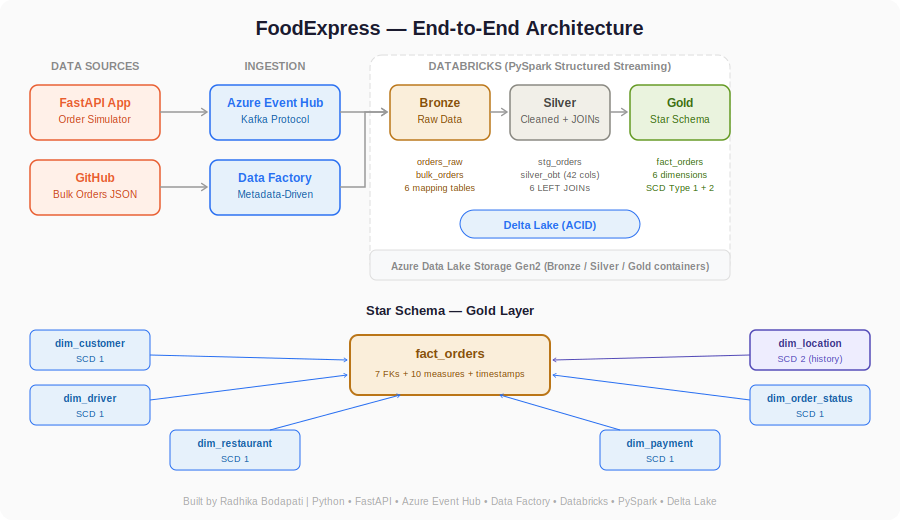

# FoodExpress — Real-Time Food Delivery Data Engineering Pipeline

An end-to-end data engineering project that simulates a food delivery platform (like DoorDash/Swiggy), streaming real-time orders through Azure Event Hub into a Databricks Lakehouse with Medallion Architecture and Star Schema.

## Architecture
```


FastAPI App ──→ Azure Event Hub ──→ Databricks (Bronze) ──→ Silver (OBT) ──→ Gold (Star Schema)
                                         ↑
GitHub (Bulk JSON) ──→ Azure Data Factory ┘
```

## Tech Stack

| Layer | Technology | Purpose |
|-------|-----------|---------|
| Data Generation | Python, Faker | Simulate realistic food delivery orders |
| Web Application | FastAPI, Uvicorn | Order placement interface |
| Streaming | Azure Event Hub (Kafka-compatible) | Real-time event ingestion |
| Batch Ingestion | Azure Data Factory | Metadata-driven bulk data pipeline |
| Storage | Azure Data Lake Storage Gen2 | Centralized data lake (Bronze/Silver/Gold) |
| Processing | Databricks, PySpark Structured Streaming | Stream processing and transformations |
| Table Format | Delta Lake | ACID transactions, time travel, schema enforcement |
| Data Model | Star Schema with SCD Type 1 and Type 2 | Dimensional modeling for analytics |
| Containerization | Docker, Docker Compose | Reproducible development environment |
| Version Control | Git, GitHub | Source control and collaboration |

## Medallion Architecture

### Bronze Layer (Raw)
- **orders_raw**: Real-time orders from Event Hub (Kafka protocol)
- **bulk_orders**: 1000 historical orders loaded via ADF
- **6 mapping tables**: restaurants, cuisines, payment methods, order statuses, delivery zones, cancellation reasons

### Silver Layer (Cleaned + Enriched)
- **stg_orders**: Merged stream (real-time + bulk) with parsed JSON
- **silver_obt**: One Big Table — stg_orders LEFT JOINed with all 6 mapping tables, 42 columns

### Gold Layer (Star Schema)
- **fact_orders**: 20 columns — order_id, 6 foreign keys, timestamps, and 10 measures (food_cost, delivery_fee, tip_amount, total_amount, rating, etc.)
- **dim_customer**: SCD Type 1 (name, email, phone)
- **dim_driver**: SCD Type 1 (name, rating, phone)
- **dim_restaurant**: SCD Type 1 (name, cuisine, avg prep time)
- **dim_payment**: SCD Type 1 (method, is_digital)
- **dim_location**: SCD Type 2 (zone, city, state, region — tracks region changes over time)
- **dim_order_status**: SCD Type 1 (status, is_completed, cancellation reason)

## Data Model

### Fact Table: fact_orders

| Column | Type | Description |
|--------|------|-------------|
| order_id | STRING | Primary key |
| customer_id, driver_id, restaurant_id | STRING/LONG | Foreign keys to dimensions |
| zone_id, payment_method_id, order_status_id | LONG | Foreign keys to dimensions |
| food_cost, delivery_fee, tax_amount | DOUBLE | Pricing measures |
| discount, tip_amount, total_amount | DOUBLE | Pricing measures |
| item_count, prep_time_minutes, delivery_time_minutes | LONG | Operational measures |
| rating | DOUBLE | Customer satisfaction measure |

### SCD Type 2: dim_location

| Column | Type | Description |
|--------|------|-------------|
| zone_id | LONG | Primary key |
| zone_name, city, state, region | STRING | Location attributes |
| effective_from | TIMESTAMP | When this version became active |
| effective_to | TIMESTAMP | When this version was replaced (null if current) |
| is_current | BOOLEAN | True for the latest version |

## Project Structure
```
FoodExpress/
├── api.py                  # FastAPI web application
├── data.py                 # Order data generator + mapping tables
├── connection.py           # Azure Event Hub producer
├── save_data.py            # Bulk data generation script
├── Dockerfile              # Docker container definition
├── docker-compose.yml      # Docker orchestration
├── requirements.txt        # Python dependencies
├── files_array.json        # ADF metadata-driven pipeline config
├── .gitignore              # Excludes secrets and cache
├── templates/
│   ├── home.html           # Order placement page
│   └── confirmation.html   # Order confirmation page
├── Data/
│   ├── bulk_orders.json    # 1000 historical orders
│   ├── map_restaurants.json
│   ├── map_cuisines.json
│   ├── map_payment_methods.json
│   ├── map_order_statuses.json
│   ├── map_delivery_zones.json
│   └── map_cancellation_reasons.json
└── Code_Files/
    ├── ingest.py           # Bronze layer — Event Hub streaming ingestion
    ├── silver.py           # Silver layer — JSON parsing, stream merging
    ├── silver_obt.sql      # Silver OBT — JOIN with 6 mapping tables
    └── model.py            # Gold layer — Star Schema + SCD Type 2
```

## How to Run

### Prerequisites
- Docker and Docker Compose
- Azure account (free tier works)
- Azure Event Hub namespace and topic
- Azure Data Lake Storage Gen2
- Databricks workspace

### Local Setup
```bash
git clone https://github.com/RadhiNagi/FoodExpress.git
cd FoodExpress
cp .env.example .env    # Add your Azure connection string
docker-compose build
docker-compose up       # Visit http://localhost:8000
```

### Generate Bulk Data
```bash
docker-compose run --rm app python save_data.py
```

### Azure Pipeline
1. Create Event Hub namespace + topic (ordertopic)
2. Create ADLS Gen2 with bronze/silver/gold containers
3. Create ADF with metadata-driven pipeline (reads files_array.json)
4. Create Databricks workspace, configure cluster Spark config:
```
   spark.connection_string YOUR_EVENT_HUB_CONNECTION_STRING
   spark.hadoop.fs.azure.account.key.YOUR_STORAGE.dfs.core.windows.net YOUR_STORAGE_KEY
```
   Then run notebooks in order:
   - ingest.py (Bronze)
   - silver.py + silver_obt.sql (Silver)
   - model.py (Gold)

## Key Design Decisions

| Decision | Choice | Rationale |
|----------|--------|-----------|
| Streaming platform | Azure Event Hub | Kafka-compatible, fully managed, free tier available |
| Table format | Delta Lake | ACID transactions, schema enforcement, time travel |
| Schema pattern | Medallion (Bronze/Silver/Gold) | Data lineage, replayability, separation of concerns |
| Data model | Star Schema | Optimized for BI queries, clear fact/dimension separation |
| SCD strategy | Type 1 (5 dims) + Type 2 (location) | Type 2 only where historical tracking matters for analytics |
| Pipeline config | Metadata-driven (files_array.json) | Add new sources without modifying pipeline code |
| Secrets management | Environment variables (.env) | Twelve-factor app methodology, credentials never in Git |

## Author

**Radhika Bodapati** 
GitHub: [@RadhiNagi](https://github.com/RadhiNagi)
